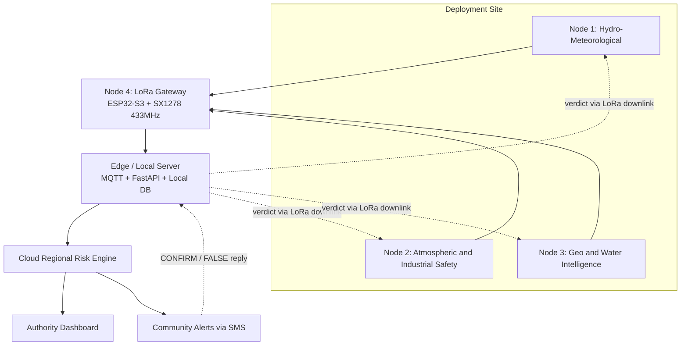
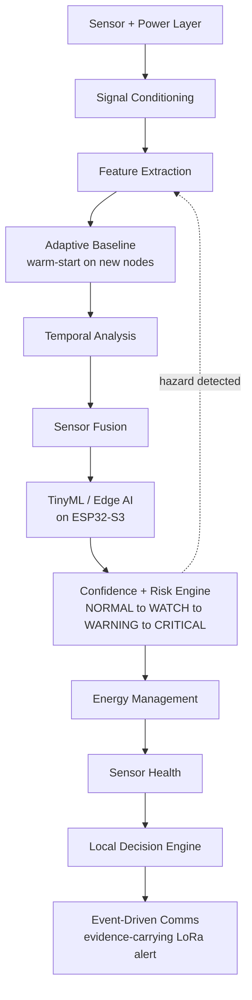

# PRAKRITI2.0--DISASTER-MANAGEMENT
A resilient, AI-powered environmental monitoring network that provides early detection, localized intelligence, and actionable alerts for floods, forest fires, pollution events, and other environmental hazards common in India, enabling authorities and communities to shift from reactive disaster response to proactive risk prevention.
# PRAKRITI2.0 — Environmental Intelligence Network

> A distributed, solar-powered, edge-AI sensor network that detects floods, fires, pollution, landslides, industrial leaks, and water-quality degradation locally — and gets measurably more trustworthy at each site over time.

## Table of Contents
- [Problem Statement](#problem-statement)
- [Our Solution](#our-solution)
- [Key Differentiators](#key-differentiators)
- [System Architecture](#system-architecture)
- [Hardware & Sensors](#hardware--sensors)
- [Tech Stack](#tech-stack)
- [Machine Learning](#machine-learning)
- [Repository Structure](#repository-structure)
- [Getting Started](#getting-started)
- [Hackathon Demo Scope (36 Hours)](#hackathon-demo-scope-36-hours)
- [Current Status](#current-status)
- [Cost & Impact](#cost--impact)
- [Risks & Mitigation](#risks--mitigation)
- [Standards & Compliance](#standards--compliance)
- [Target Stakeholders](#target-stakeholders)
- [Team](#team)
- [License](#license)
- [Acknowledgments](#acknowledgments)

## Problem Statement

**PS ID 26178** — *A resilient, AI-powered environmental monitoring network that provides early detection, localized intelligence, and actionable alerts for floods, forest fires, pollution events, and other environmental hazards common in India, enabling authorities and communities to shift from reactive disaster response to proactive risk prevention.*

India faces recurring, overlapping environmental risks — river and urban floods in Assam, Bihar, Kerala and Maharashtra; forest fires across Uttarakhand, Himachal Pradesh, and central India; chronic urban air pollution; and landslides in hill states. Existing systems (NDMA, IMD, ISRO) are largely centralized and don't give hyperlocal, real-time intelligence. A distributed network of solar-powered, edge-AI sensor nodes can close that gap: detect locally, decide locally, and only send what matters upstream.

**Expected solution, in brief:** distributed smart sensor nodes with on-device AI, a multi-hazard early-warning system, regional risk mapping, authority + community notification, and a cloud/edge hybrid architecture that scales from one village to a state-wide grid.

## Our Solution

PRAKRITI deploys **three independent sensing nodes plus one gateway node per site**. Each sensing node runs full edge-AI inference on its own — there are no cross-node dependencies, so any node can be deployed alone or as part of a full cluster. Only summarized risk assessments and alerts leave the site; raw sensor streams stay local.

| Node | Hazards Covered | Key Sensors |
|---|---|---|
| **Node 1** — Hydro-Meteorological Intelligence | Flood / flash flood, severe weather, drought | AJ-SR04M (water level), GY-BME280 (temp/humidity/pressure), soil moisture, raindrop sensor |
| **Node 2** — Atmospheric & Industrial Safety | Fire/smoke, pollution, gas leak | PM2.5/PM10, MQ-7 (CO), MQ-6 (LPG), MQ-135 (NH3/VOC), flame/IR, temp/humidity |
| **Node 3** — Geo + Water Intelligence | Landslide precursor, water quality | MPU6050 (vibration), soil moisture, pH, turbidity, TDS/EC, water temperature, rain gauge |
| **Node 4** — LoRa Gateway | Comms backbone | ESP32-S3-N16R8 + LoRa-02 SX1278 433MHz, onboard WiFi / optional GSM backhaul |

## Key Differentiators

Sensing hyperlocal hazards is table stakes — the bottleneck disaster-response agencies actually face is **institutional trust and upkeep**, not raw sensing. PRAKRITI addresses that directly:

1. **Evidence-carrying alerts** — every WARNING/CRITICAL alert ships with its top contributing features, model confidence, and sensor-health state, not just a bare severity tier. A responder can see *why* the model fired, not just *that* it fired.
2. **Closed-loop field labelling** — a responder replies CONFIRM or FALSE by SMS from the field. That verdict routes back over a LoRa downlink, is stored on-node, and shifts that specific site's decision boundary — so the network gets more accurate at each location over time instead of staying static after deployment.
3. **Warm-start site profiles** — a newly commissioned node pulls the learned baseline of its matched site class from the cloud instead of learning "normal" blind for ~14 days before it can classify reliably.

## System Architecture

### End-to-end flow



A Cloud Regional Risk Engine aggregates every site in a district or state into one regional risk map — scaling to more sites adds load, it never requires redesigning the pipeline.

### On-node pipeline (runs identically on Nodes 1–3)



Energy Management and Sensor Health gate the final alert — a CRITICAL classification from a node with a fouled sensor or low battery gets flagged, not sent blind.

## Hardware & Sensors

**Node 1 / Node 4 pin assignments** (Node 4 reuses the same LoRa pins):

| Function | Pin |
|---|---|
| LoRa SX1278 — SCK | GPIO12 |
| LoRa SX1278 — MISO | GPIO13 |
| LoRa SX1278 — MOSI | GPIO11 |
| LoRa SX1278 — NSS | GPIO10 |
| LoRa SX1278 — RESET | GPIO9 |
| LoRa SX1278 — DIO0 | GPIO8 |
| BME280 — SDA | GPIO4 |
| BME280 — SCL | GPIO5 |
| AJ-SR04M — TRIG | GPIO6 |
| AJ-SR04M — ECHO | GPIO7 (via voltage divider) |
| Soil moisture (analog) | GPIO1 |
| Raindrop sensor (analog) | GPIO2 |

Power: solar panel + charge controller + Li-ion battery + voltage regulation, with energy-aware sampling and low-power sleep modes on every node.

## Tech Stack

| Layer | Technology |
|---|---|
| Firmware | ESP-IDF (ESP32-S3), FreeRTOS, RadioLib, TensorFlow Lite for Microcontrollers, deep-sleep + NVS |
| Backend | Eclipse Mosquitto (MQTT), Python + FastAPI, InfluxDB, Node-RED |
| Dashboard | Grafana, React.js, Leaflet.js, Recharts |
| ML / Data | TensorFlow, Pandas, NumPy |
| Dev tooling | PlatformIO |
| Languages | C++, Python, TypeScript, SQL, JSON |

## Machine Learning

`train_and_convert.py` builds Node 1's risk classifier:
- Generates synthetic flood training data
- Extracts **18 features** (mean / RMS / variance / rate-of-change / trend / persistence, across 3 signals: water level, rainfall, pressure)
- Trains a compact dense neural net (16 → 8 → 4)
- Quantizes to int8 and exports **TensorFlow Lite Micro**
- Outputs `model_data.h` (`g_risk_model`, `g_risk_model_len = 3736`, `kNumFeatures = 18`, classes `NORMAL / WATCH / WARNING / CRITICAL`, plus `kFeatureMean` / `kFeatureStd`)
- Arduino-side inference via `Chirale_TensorFlowLite` + `ArduTFLite`

> Current accuracy (100% validation) is on **synthetic data only** — a placeholder until real sensor logs are collected and the model is retrained.

## Repository Structure

> Suggested layout — adjust to match what's actually pushed.

```
PRAKRITI-SIH26178/
├── firmware/
│   ├── node1-hydro-met/        # ESP32-S3 + sensors + LoRa SX1278
│   └── node4-gateway/          # LoRa receiver, test build (Serial stand-in backend)
├── ml/
│   ├── train_and_convert.py
│   └── model_data.h
├── backend/                    # FastAPI + MQTT + InfluxDB
├── dashboard/                  # React + Leaflet.js + Recharts
├── docs/
│   ├── architecture.md
│   └── problem-statement.md
└── README.md
```

## Getting Started

1. Clone the repo and open `firmware/node1-hydro-met/` in PlatformIO.
2. Wire Node 1 per the [pin table](#hardware--sensors) above; flash via PlatformIO.
3. Flash `firmware/node4-gateway/` to a second ESP32-S3 + LoRa-02 SX1278 board.
4. From `ml/`, run `python train_and_convert.py` to regenerate `model_data.h` after collecting new sensor data.
5. Node 4 currently prints decoded packets to Serial as a stand-in backend; SIM800L cellular backhaul is deferred to a later milestone.

## Hackathon Demo Scope (36 Hours)

Team split across the 36-hour build window:
- **2** — Firmware (Nodes 1 & 4)
- **1** — TinyML pipeline
- **2** — Backend + dashboard
- **1** — Hardware + enclosure
- **1** — Data collection & validation

## Current Status

- ✅ Node 1 hardware assembled and wired
- ✅ Node 4 gateway test build (LoRa-only; Serial stand-in backend)
- ✅ TinyML risk classifier trained, quantized, validated on synthetic data
- 🔲 Node 2 (Atmospheric & Industrial Safety) hardware build
- 🔲 Node 3 (Geo + Water Intelligence) hardware build
- 🔲 Real sensor data collection → model retraining
- 🔲 Edge/local server + Cloud Regional Risk Engine
- 🔲 Authority dashboard + community SMS alerts

## Cost & Impact

| Metric | Value |
|---|---|
| Cost per node | ₹2,800 |
| Cost per site (3 nodes + gateway) | ₹8,500 |
| 100-site district grid | ~₹8.5 lakh |
| Indicative O&M | ~₹1,200 / site / year |
| Battery autonomy | ≥ 7 days |
| Target extra lead time | 30–60 minutes vs. reactive response |
| Target false-alarm rate | < 1 false CRITICAL per node-month |

**Ownership model:** Gram Panchayat owns the physical asset; District DMA operates and monitors it.

## Risks & Mitigation

| Risk | Mitigation |
|---|---|
| Sensor drift & false alarms | Multi-layer sensor fusion |
| Field power & connectivity loss | Resilient edge + mesh design |
| On-device compute limits | Lightweight, modular TinyML |
| Harsh field exposure & tampering | Ruggedized IP67 tamper-aware enclosures, vibration flagged via Sensor Health |

## Standards & Compliance

- IP67 enclosure rating
- LoRaWAN IN865 RP002 regional parameters
- CPCB siting norms for pollution sensors

## Target Stakeholders

- **Authorities:** NDMA & State/District DMAs, IMD, CPCB/SPCBs, FSI, GSI, Municipal Corporations & Panchayats
- **Communities:** flood-prone river villages, hill-slope/forest-fringe areas, industrial-zone neighborhoods
- **Users:** NDRF/SDRF responders, industrial safety officers, local disaster committees

## Team

**PRAKRITI** — Smart India Hackathon 2026, Problem Statement 26178 (7 members)

## License


## Acknowledgments

Smart India Hackathon, Qualcomm Inc (problem statement sponsor), and the public early-warning work of NDMA, IMD, and ISRO that this project builds on.
